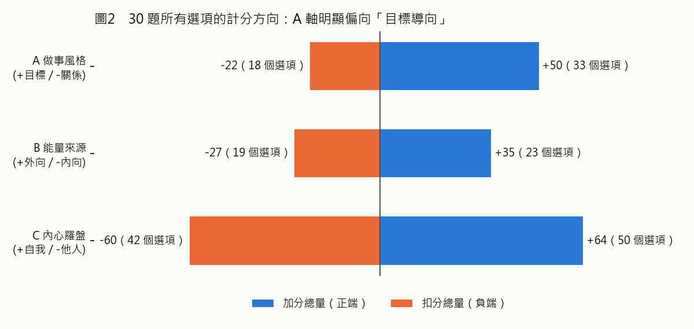
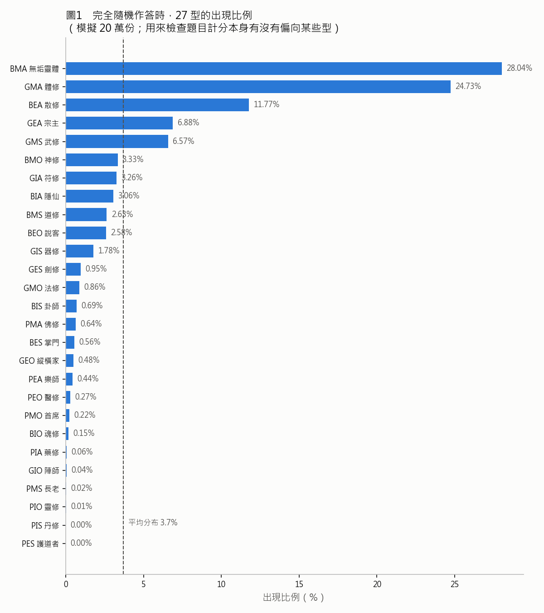

# GT-V1 會前研究簡報

> 研究日期：2026-10-06　｜　研究範圍：`E:\GitHub\GT-V1\`，重點是未提交的 `類型分析/` 資料夾
> 用途：開會時決定「特質分析」要做到哪裡。本文件**只做研究、沒有改任何程式或內容**。

---

## 一、資料夾裡有什麼

| 檔案 | 內容 | 狀態 |
|---|---|---|
| `類型分析/GT_V1_Phase0_v03.pdf` | **Phase 0 規格書 v0.3 Final**（2026-03-28）：構念定義、預期相關、判死刑標準、文案規範、認知訪談、Pilot 配置 | 最新版，以這份為準 |
| `類型分析/GT_V1_Phase0_Spec.pdf`、`_v02.pdf` | 規格書 v0.1、v0.2 | 被 v0.3 取代 |
| `類型分析/GT_V1_Full_Questions.md` | 題庫 28 題 + 計分表 + 設計原則檢核 | **已過時**：網站現在是 30 題，理論最大／最小分也不一樣 |
| `類型分析/index.html` | 舊版網站（改成修仙主題之前） | 備份性質 |
| 根目錄 `index.html` + `types.js` | 現行網站：30 題、27 型修仙描述（d/style/pain/view/blind 五欄） | 線上版本 |
| `GT_V1_19types_instruction.md`、`GT_V1_Session_Summary_0331.md` | 3～4 月的開發紀錄 | 參考用 |
| `img/` | 20 張角色圖（其中 9 張還沒 commit） | 缺 7 型；**網站目前沒有用到任何一張** |

---

## 二、問卷在心理學上量的是什麼（構念對照）

規格書的三軸各自對應到既有的心理學概念。以下是我整理的對照，正式報告會附完整出處：

| 軸 | 規格書定義 | 對應的心理學概念 | 規格書預期的效標 |
|---|---|---|---|
| **A 驅力方向**（網站：做事風格） | 「搞定事情」與「顧好人」只能選一邊時，比較受不了哪邊沒做到 | 任務導向 vs 關係導向（Blake & Mouton 管理方格、Fiedler 權變模型）；**能動性 Agency vs 共融性 Communion**（Bakan, 1966） | 與 BFI 親和性負相關 r = −.40～−.55 |
| **B 能量模式**（網站：能量來源） | 跟人相處後，電池是充了還是掉了 | 外向／內向（Eysenck 的激發理論；Big Five 外向性） | 與 BFI 外向性正相關 r = .35～.50 |
| **C 判斷獨立性**（網站：內心羅盤） | 大家都說 A 對、你覺得是 B，想法會不會動搖（**只量心裡怎麼想，不量敢不敢說**） | 內在導向 vs 他人導向（Riesman, 1950）、從眾（Asch, 1951）、自我監控（Snyder, 1974）、獨立／互依自我建構（Markus & Kitayama, 1991） | 暫用開放性當效標（規格書自己承認不是理論上的對應） |

**補充觀察**：專案原名「Gender Typology」，而 A 軸的「能動性／共融性」正好是性別角色研究的核心兩個維度（Bem 性別角色量表就是建立在這上面）。這個名稱是不是刻意的，需要老闆確認（見第五節 Q5）。

---

## 三、現行網站和規格書的落差

規格書 v0.3 要求的 vs 網站實際做的：

| 項目 | 規格書 v0.3 要求 | 現行網站 | 落差程度 |
|---|---|---|---|
| 題型 | **代價題**：兩個選項都讓人不舒服，選「比較能忍受」的那個（消除社會期許） | 4 選 1 情境題，很多選項是「喜歡什麼」 | 🔴 核心策略沒有落實 |
| C 軸範圍 | 嚴格限縮在**認知層面**，禁止量「敢不敢說」（那是 Assertiveness） | Q4「直接說你沒興趣」、Q5「忍不住想說，而且通常會說」、Q8「直接說你覺得還好」都量到表達行為 | 🔴 規格書列為 C 軸淘汰條件 |
| 焦慮混入 | 禁止把害羞／焦慮（神經質）混進來 | Q14、Q21 的「有點不安…」、Q24「擔心別人怎麼看你」都算成「他人導向」 | 🟠 C 軸可能變成在量焦慮 |
| 附加模組 | 摩擦層 6 題、狀態 5 題、BFI-10、注意力檢核、印象管理題 | 全部沒有 | 🟠 無法驗證信效度 |
| Pilot 驗證 | N ≥ 100 實測，α/ω ≥ .65 才能上線 | 沒有收過任何作答資料 | 🔴 規格書的「判死刑標準」一條都還沒跑 |
| 結果文案 | **禁用**本質化語句（「你就是…型的人」）、穩定性誇大（「你天生就…」「你總是…」） | 修仙描述大量使用，例如 GES：「你天生就是那個拔劍領路的人」 | 🔴 文案方向直接衝突 |
| 免責聲明 | 規格書有指定文字 | commit `35ebe0a` 移除了免責聲明卡片 | 🟡 |

---

## 四、題目結構檢查（不需要作答資料就能做的部分）

我把網站上的 30 題和計分抽出來，做了結構檢查和 20 萬份**完全隨機作答**的模擬。隨機作答不代表真人，但可以看出**計分設計本身有沒有偏向某些型**——理想狀況下，隨機作答應該不會特別偏向哪一型。

### 發現 1：A 軸的計分偏向「目標導向」

- A 軸：加分選項總量 +50，扣分只有 −22。隨機亂答時，A 軸平均落在「目標」那側。
- B、C 軸大致平衡。

### 發現 2：27 型出現機率極不平均，有幾型幾乎測不到

- 中間型被大量灌入：BMA（無垢靈體）28%、GMA（體修）25%。
- **PES 護道者、PIS 丹修 在模擬中是 0%**，PIO、PMS、GIO 也低於 0.05%。我另外確認過：27 型理論上都**測得到**，但「關係導向」這一端非常難達到。
- 原因：A 軸偏向目標（發現 1），再加上中間區間（−2～+2）的寬度。

### 發現 3：A 軸和 C 軸的計分綁在一起

- 很多選項同時給「A+2、C+1」（目標導向＋自我導向一起加），選項層級的 A–C 相關 r = .35，隨機作答下兩軸分數相關 r ≈ .39。
- 規格書把「C 與 A 的 |r| > .55」列為砍掉 C 軸的條件。現在還沒超過，但這是**題目設計本身造成的**，真人作答很可能更高。

### 其他小問題
- 30 題中 29 題同時計 2～3 軸，只有 1 題是單軸。
- Q26 選項 a「聽聽看，有道理就參考」三軸都是 0 分。
- 題庫文件（28 題）的理論最大／最小分（A：+42／−28）和網站實際值（A：+40／−18）不一樣，文件已過時。

### 靈根規則不一致
- **GIO（陣師）**：金＋水＋月，同時符合「雷（金＋月）」和「冰（水＋月）」，程式只給雷，規則文件沒寫優先順序。
- **中間型（B）的描述寫「金木雙靈根」**（例如 BES 掌門、BEO 說客），但程式資料裡 BES 只有火、土兩根。文字和資料不一致。
- **「月」的定位**：CLAUDE.md 寫成五行之一，3/31 開發紀錄寫成「變異靈根」。

---

## 五、需要老闆決定的事（開會議題）

**Q1. 「此資料夾」指的是哪個？**
工單收件匣是空的，我研究的是 `GT-V1/類型分析/`，順便研究了整個 GT-V1 專案。如果你指的是別的資料夾，請告訴我。

**Q2. 「特質分析」要做哪一種？**（這題決定整個工作量）
- (A) **27 型特質分析**：每一型寫一份有心理學依據的分析＋圖（三軸座標、對應 Big Five 方向、優勢與代價、適合／不適合的環境）
- (B) **問卷本身的心理計量分析**：題目品質、信度、效度、因素結構 → 這需要真人作答資料
- (C) 兩者都做

**我的建議**：先做 (A) ＋ 第四節的結構分析，(B) 等有資料再做。

**Q3. 文案走修仙風還是規格書的心理學規範？**
規格書禁止「你天生就…」「你就是…型的人」這類說法，但現行修仙描述就是這種寫法。選項：
- 保留修仙描述當娛樂層，另外加一層「心理學解讀」，照規格書規範寫（**建議這個**）
- 全部改寫成符合規格書
- 不管規格書，照修仙風繼續寫

**Q4. 要不要收真人作答資料？**
沒有資料就不能做信效度分析，規格書也規定要先跑 Pilot（N ≥ 100）。但 README 承諾「無後端、無追蹤、無資料收集」。可以用匿名 Google 表單之類的方式，讓受試者自願提交——需要你決定。

**Q5. 「Gender Typology」這個名稱是什麼意思？**
是刻意對應性別角色理論（能動性／共融性）嗎？分析報告要不要提到性別？（規格書寫「引導語零性別字眼」）

**Q6. 第四節的題目問題要不要修？**
A 軸偏向、PES/PIS 幾乎測不到——修題目會改變所有人的測驗結果。要在這一輪一起修，還是先只做分析報告？

**Q7. 靈根規則**（GIO 雷還是冰、中間型算不算金木雙根、月的定位）由你決定，還是我提方案給你選？

**Q8. 上 GitHub 的形式**
- 網站新增一頁「27 型特質圖鑑」（例如 `analysis.html`），從結果頁連過去
- 或放在 repo 的 `docs/` 當文件
- 我會在本機 commit，**push 由你執行**

**Q9. 圖片和舊檔處理**
- `img/` 有 9 張還沒 commit，7 型缺圖（BMS、BMO、GMA、PMA、BEA、BIA、BMA），而且網站沒有用到這些圖。要放進分析頁嗎？缺的 7 張要用 AI 補畫嗎？
- `類型分析/index.html`（舊版網站）要保留還是刪除？

---

## 六、我可以先做、不需要等開會的事

- 更新過時的 `CLAUDE.md` 和題庫文件（改成反映 30 題、types.js、修仙主題的現況）
- 把第四節的模擬分析寫成可重跑的腳本，題目修改後可以馬上重新檢查

這兩件我還沒動，等你說可以再做。
